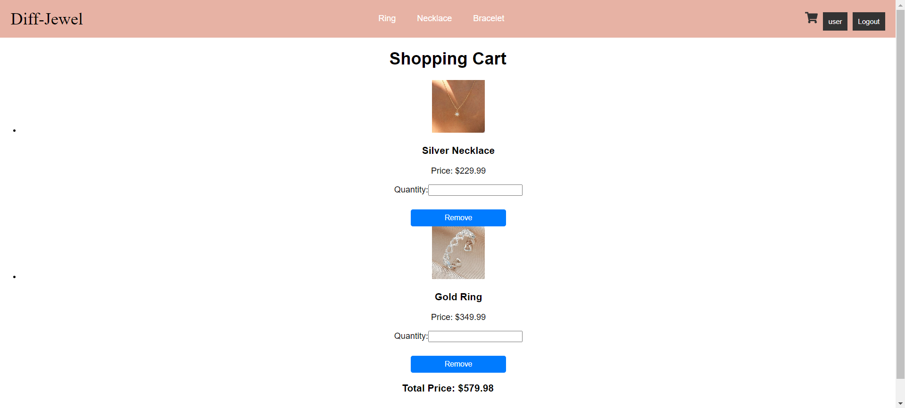

# E-Commerce System

This is an e-commerce web application developed using Java Spring for the backend and React for the frontend. The project aims to provide a fully functional online store where users can browse products, add them to their cart, and make purchases.

## Table of Contents

- [Features](#features)
- [Technologies Used](#technologies-used)
- [Installation](#installation)
- [Usage](#usage)
- [Screenshots](#screenshots)
- [Contributing](#contributing)

## Features

- User registration and login
- Product browsing with detailed views
- Adding products to the cart
- Directly saving orders without using order items
- Displaying orders in the cart
- Responsive design for various devices

## Technologies Used

### Backend

- Java Spring Boot
- Spring Data JPA
- Spring Security
- MySQL
- Lombok

### Frontend

- React
- Bootstrap

## Installation

### Prerequisites

- Java 17
- Node.js and npm
- MySQL database

### Backend

1. Clone the repository:

   ```sh
   git clone https://github.com/busekeklik/E-Commerce-System.git
   cd E-Commerce-System/backend

2. Update the MySQL database configuration in application.properties file:

spring.datasource.url=jdbc:mysql://localhost:3306/your_database_name
spring.datasource.username=your_username
spring.datasource.password=your_password

3. Build and run the backend application:
 ```sh
./mvnw spring-boot:run
```
### Frontend

1. Install the dependencies:

```sh
   npm install
```
2. Start the frontend application:

```sh
npm start
```

The backend server will be running on 'http://localhost:8080' and the frontend on 'http://localhost:3000'.


### Usage

Open the browser and navigate to http://localhost:3000.
Register a new user or login with existing credentials.
Browse the available products and add them to the cart.
Proceed to checkout to place an order.

### Screenshots

### Home Page


### Login Page


### Register Page


### Category Page


### Cart Page


### Contributing

Contributions are welcome! Please fork the repository and create a pull request with your changes. Make sure to follow the coding standards and write appropriate tests.

1. Fork the repository
2. Create a new branch (`git checkout -b feature/your-feature-name`)
3. Commit your changes (`git commit -am 'Add new feature'`)
4. Push to the branch (`git push origin feature/your-feature-name`)
5. Create a new Pull Request
